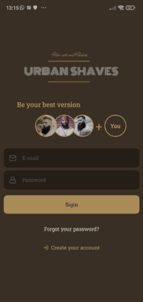
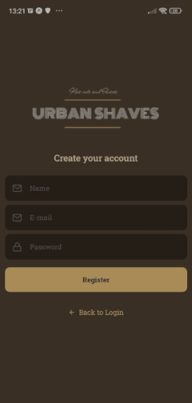
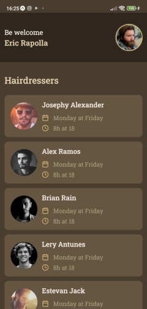

<div align="center">


  


  
</div>

<br/>
<br/>

<p align="center">

</p>

## **💻 Projeto**

O App mobile <strong>Urban Shaves</strong> foi desenvolvido em [React Native](https://reactnative.dev/) utilizando o [Expo](https://docs.expo.dev/).

#### **Screens**

<p align="center">
  
  
  
</p>
<p align="center">
  
  
</p>

## **🔖 Layout**

<p>Criamos a logo <strong>Urban Shaves</strong>, utilizamos a seguinte tabela de cores:
</p>

  
## Get Started

Certifique-se de usar a versão lts do node v16.15.1. Para para gerenciar a versão correta node instale o [nvm](https://github.com/nvm-sh/nvm).
Instale o App [Expo](https://play.google.com/store/apps/details?id=host.exp.exponent&hl=en&gl=US) em seu dispositivo mobile, execute os comandos abaixo. Faça o scanner do QR Code gerado.

```bash
# Instalação das dependências
$ yarn

# Start
$ yarn start
```

## Observação

O projeto possui um App mobile, desktop e uma API que estão em desenvolvimento.

## **👨‍🚀 Autor**

<a href="https://github.com/tpaphysics">

  <br />
  <sub>
    <b>Thiago Pacheco de Andrade</b>
  </sub>
</a>
<br />
  
👋 Meus contatos!
  
[](https://www.linkedin.com/in/thiago-pacheco-200a1a86/)
[](mailto:physics.posgrad.@gmail.com)
  
##   Licença
  
  
  
Veja o arquivo [MIT license](LICENSE ).
